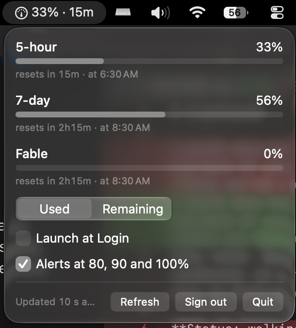

# tracklaude

A macOS menu-bar app that shows how much of your Claude rate limits you have used and when
they reset. Open source, sandboxed, no auto-updater, talks only to Anthropic.



It exists because the alternative was a self-signed, self-updating binary that asked for a
full claude.ai session cookie. tracklaude asks for less, does less, and is built in public
so you can check both claims. Everything below that starts with "the app never…" is either
enforced by a test that runs on every push or is pointed at the source lines you can read.

## What it shows

- **Menu bar:** the 5-hour window as `42% · 2h14m` — utilization and time to reset. `—`
  when Anthropic reports no active window. When a fetch fails the last good value stays,
  dimmed, followed by `⚠` and one word: `offline`, `limited`, `expired` or `error`.
- **Popover:** every window Anthropic reports — 5-hour, 7-day, and per-model 7-day windows
  when they exist — each with a bar, the percentage, a relative and an absolute reset time
  in your locale. A used ↔ remaining toggle. When something is wrong, a banner says what
  (not signed in, offline, rate-limited, session expired) and offers the fix.
- **Alerts:** a notification the first time any window crosses 80 %, 90 % and 100 % in a
  cycle, and one when the 5-hour window resets after you were above 80 %. Off with one
  click.
- **Footer:** last-updated age, Refresh, Launch at Login, Alerts, Sign out, Quit.

It polls while your Mac is awake, pauses during sleep, fetches immediately on wake and
when you open the popover, and backs off when Anthropic returns 429.

## Install

Requires macOS 14 or later. Homebrew is coming; for now:

1. Download `tracklaude-vX.Y.Z.zip` and `tracklaude-vX.Y.Z.zip.sha256` from the
   [latest Release](https://github.com/adios-404/tracklaude/releases/latest).
2. Verify the download matches what CI built — see [Verify a release](#verify-a-release).
3. Unzip, and move `tracklaude.app` to `/Applications`.
4. **First launch: the Gatekeeper step.** The app is not notarized (see [why](#why-there-is-no-notarization)), so macOS refuses the first double-click:
   - **macOS 14:** right-click (Control-click) `tracklaude.app` → **Open** → **Open**.
   - **macOS 15 and later:** double-click once and dismiss the warning, then open
     **System Settings → Privacy & Security**, scroll to the notice that tracklaude was
     blocked, and click **Open Anyway**.

   This is a one-time step per download.
5. Click the menu-bar item and **Sign in**. Your default browser opens Anthropic's own
   login page; after you approve, the browser lands on a one-line page served by the app on
   `localhost` and you can close the tab. Nothing is pasted anywhere.

### The password prompt on first launch, and after every update

On the first launch after sign-in — and again on the first launch of every new version —
macOS asks for your login password **twice**. This is the Keychain, not the app: releases
are ad-hoc signed, which means each build has a different code hash, and the Keychain item
holding your credential is bound to the hash that created it. The first prompt lets the new
build read the item, the second adds the new build to the item's access list. Enter your
password both times (or click *Always Allow*); the same build never asks again.

We accept this cost deliberately. The alternative — signing every release with a private key
held in CI — would give the app a stable identity at the price of asking you to trust that
key forever, which is the property this project set out to avoid. If a paid Apple Developer
account ever appears, notarized releases would end both this prompt and the Gatekeeper step.

## What it talks to

Exactly three hosts, all Anthropic's, plus loopback during sign-in. Nothing else, ever.

| Host | When | Why |
|---|---|---|
| `claude.ai` | Sign-in | Opens `https://claude.ai/oauth/authorize` in your browser (OAuth 2.0 with PKCE). The app itself never connects here — your browser does. |
| `console.anthropic.com` | Sign-in, and when the access token expires | `POST /v1/oauth/token` to exchange the sign-in code for tokens, and later to refresh them. |
| `api.anthropic.com` | Every poll | `GET /api/oauth/usage` with `Authorization: Bearer <access token>` and `anthropic-beta: oauth-2025-04-20`. That is the whole request: no browser-impersonating headers, no identifiers, no analytics. |
| `localhost` (`127.0.0.1` / `::1`), port 1456 or 1458 | Sign-in only | A loopback-only listener that receives the browser's OAuth callback, checks the `state` value, and shuts down. It is bound to the loopback interface, not to your network. |

There is no update check, no crash reporter, no telemetry endpoint, no CDN. CI enforces this
with [`Scripts/check-hostnames.sh`](Scripts/check-hostnames.sh): every URL host, IPv4
literal and dotted name found in the built binary *and* in `Sources/` must be one of the
five above, or the build fails.

What that check cannot see: a host assembled at runtime from pieces, and names under TLDs
the extractor ignores because they double as ordinary words (`.app`, `.sh`, `.so`, `.it`,
`.in`). It catches the honest mistake of a new literal; it is not a substitute for reading
the source, which is short. Start at
[`Sources/TracklaudeCore/OAuth/OAuthConfig.swift`](Sources/TracklaudeCore/OAuth/OAuthConfig.swift)
and [`Sources/TracklaudeCore/Usage/UsageFetch.swift`](Sources/TracklaudeCore/Usage/UsageFetch.swift).

## What it holds

- **A narrow OAuth refresh token** (prefix `sk-ant-ort01-`, scope `user:profile`), in its
  own macOS Keychain item (`com.adios404.tracklaude` / `credential`). Never a claude.ai
  session cookie, never anything that can read or send your conversations. Access tokens
  live in memory only. **Sign out** deletes the Keychain item. Decision and trade-offs:
  [ADR-0001](docs/adr/0001-own-oauth-credential.md).
- **It never touches Claude Code's credentials.** Claude Code keeps its own Keychain item;
  tracklaude reads and writes only its own.
- **Three preferences** in UserDefaults, none secret: alerts on/off, used/remaining, and a
  mirror of the Launch-at-Login state. Launch at Login itself is a standard macOS login item
  that you can also see and remove in *System Settings → General → Login Items*.
- **No files.** The app writes no log files, caches, or history. Its only output is the
  unified system log (`log show --predicate 'process == "tracklaude"'`), and every line
  passes through a redactor that strips `sk-ant-…` tokens, `Bearer` values and JSON token
  fields before logging — see
  [`Sources/TracklaudeCore/Logging/LogRedactor.swift`](Sources/TracklaudeCore/Logging/LogRedactor.swift)
  and its tests. Log lines are deliberately `.public` so that `log show` is readable when
  you need to debug; the redactor is the only thing between your credential and that log,
  which is why it is tested and why CI refuses any other logging call
  ([`Scripts/check-log-redaction.sh`](Scripts/check-log-redaction.sh)).

## Trust

### No auto-update, on purpose

tracklaude has no updater and no version check. You update by downloading the next Release
(or, soon, `brew upgrade`). A self-updating app means every future release, signed by one
person's key, can silently replace the code you audited; without notarization there is no
backstop. Removing the updater removes that dependency: the build you verified is the build
that runs, until you choose otherwise. Reasoning: [ADR-0002](docs/adr/0002-no-auto-update.md).

### Why there is no notarization

Notarization requires a paid Apple Developer account and a Developer ID certificate. This
project has neither, and rather than sign releases with a self-made certificate whose
private key sits in CI, it ships ad-hoc signed builds and asks you to verify them against
the public CI run instead. That is the trade: one Gatekeeper click and a Keychain prompt per
update, in exchange for no key you have to trust.

### Sandbox

The app runs in the macOS App Sandbox with exactly three entitlements — `app-sandbox`,
`network.client` (HTTPS to the hosts above) and `network.server` (the loopback listener
during sign-in). No file access, no camera, no contacts, no Keychain access groups. The
source of truth is [`Packaging/tracklaude.entitlements`](Packaging/tracklaude.entitlements);
on every push CI reads the entitlements actually embedded in the signed bundle and fails
unless they are exactly those three
([`Scripts/check-entitlements.sh`](Scripts/check-entitlements.sh)).

### What's enforced vs. what needs your eyes

Enforced by `make trust`, which runs in CI on every push and in the release job before
anything is published:

- every log line is redacted, and no other logging or file-writing call exists;
- the binary and source name no host outside the five listed above;
- the signed app carries exactly the three entitlements.

Not enforced, and worth a look if you are deciding whether to trust it: that the OAuth scope
requested really is `user:profile` (`OAuthConfig.swift`), that the usage request carries
nothing beyond the two headers (`UsageFetch.swift`), and that the loopback server binds to
loopback only (`Sources/tracklaude/Adapters/LoopbackCallbackServer.swift`).

One open question, stated in ADR-0001: the app signs in with the public OAuth client id that
Claude Code ships with. Whether Anthropic tolerates third-party use of it is not documented.
If sign-in ever fails with `invalid_client`, that is why.

## Verify a release

Every Release is built by [`.github/workflows/release.yml`](.github/workflows/release.yml)
from the tagged commit on a GitHub-hosted runner, after the full test suite and the trust
checks pass. The Release body links that run and repeats the zip's SHA-256. To check that
your download is that build:

```bash
cd ~/Downloads
shasum -a 256 -c tracklaude-vX.Y.Z.zip.sha256
```

Expected output: `tracklaude-vX.Y.Z.zip: OK`. The `.sha256` file is the one attached to
the Release; compare it with the hash printed in the linked workflow run's log if you want
to rule out a tampered Release page too. To go further, build from source at the same
tag and compare behaviour; the ad-hoc signature is not bit-reproducible across machines,
so the zips will differ, but the code will not.

The version inside the app (`Info.plist`) always equals the tag; the release job refuses
to publish otherwise.

## Build from source

Requires macOS 14+ and the Xcode Command Line Tools (`xcode-select --install`). Xcode
itself is not needed.

```bash
make install   # build (release), bundle, ad-hoc sign, copy to /Applications
open /Applications/tracklaude.app
```

Other targets: `make build`, `make test`, `make bundle`, `make sign`, `make trust`,
`make zip`, `make run`, `make clean`.

### Tests

```bash
make test
```

With only Command Line Tools installed, bare `swift test` builds successfully but silently
runs **zero** tests — SwiftPM cannot find Swift Testing's framework directory without
Xcode. `make test` passes the missing search path. See the comment in the `Makefile`. The
suite runs offline, in well under a second, and never touches your Keychain or your usage.

### Stop the Keychain prompt during development

Every rebuild is a new ad-hoc code hash, so every rebuild asks for your password twice (see
[above](#the-password-prompt-on-first-launch-and-after-every-update)). To give your local
builds a stable identity, create a self-signed code-signing certificate once and sign with
it:

1. Open **Keychain Access** → menu **Keychain Access → Certificate Assistant → Create a
   Certificate…**
2. Name: `tracklaude-dev` (anything you like). Identity Type: **Self Signed Root**.
   Certificate Type: **Code Signing**. Create.
3. In Keychain Access, find the new certificate under *My Certificates*, open it, expand
   **Trust**, and set *Code Signing* to **Always Trust**.
4. Sign with it:

   ```bash
   make install SIGN_IDENTITY=tracklaude-dev
   ```

`SIGN_IDENTITY` defaults to `-` (ad-hoc), which is what releases use. The certificate lives
only on your machine and only affects builds you make there.

### Cutting a release (maintainers)

Set `VERSION` to the new number, commit, tag and push:

```bash
git tag v0.2.0 && git push origin v0.2.0
```

The release workflow tests, signs, runs the trust checks, zips, hashes, and publishes the
Release with generated notes. A tag that does not match `VERSION` fails the job. Tags with
a suffix (`v1.0.0-rc1`) are published as pre-releases.

## Reading further

- [`CONTEXT.md`](CONTEXT.md) — the vocabulary (Window, Utilization, Credential, Snapshot…).
- [ADR-0001: the app holds its own narrow-scope OAuth refresh token](docs/adr/0001-own-oauth-credential.md)
- [ADR-0002: no auto-update mechanism](docs/adr/0002-no-auto-update.md)
- [`research/usage4claude-study.md`](research/usage4claude-study.md) — the primary-source
  study of Usage4Claude v3.4.1 that this app was designed against: its signing, network
  surface, token handling and updater.

## License

MIT — see [`LICENSE`](LICENSE).
